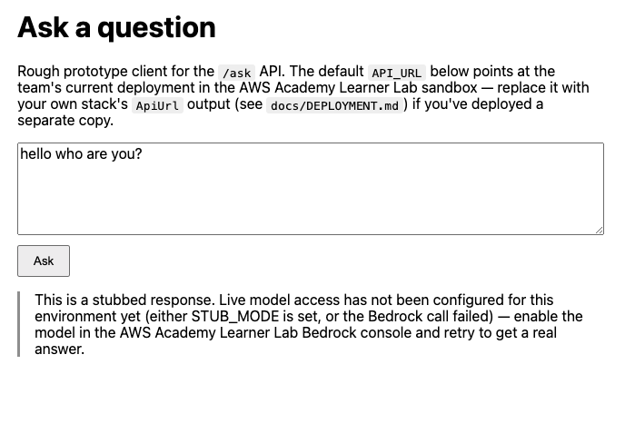

# AI Cloud — Q&A Starter

A minimal, serverless Q&A prototype and starting cloud architecture, built
for deployment in the **AWS Academy Learner Lab** sandbox. Accepts a
question, calls Amazon Bedrock for a model-generated answer, and falls back
to a clearly-labeled stub if Bedrock isn't reachable yet — so the prototype
runs today even before model access is configured.

**Live deployment:** `https://b7c2qhtbn9.execute-api.us-east-1.amazonaws.com/ask`
(deployed in the team's AWS Academy Learner Lab account; currently answers
via the stub path — see [`docs/LEARNER_LAB_REVIEW.md`](docs/LEARNER_LAB_REVIEW.md)
for why). **This is a POST-only API endpoint, not a webpage** — opening it
directly in a browser sends a GET request, which doesn't match any route
and shows a blank/404 response. That's expected, not a bug. To actually see
it work, use the frontend (see "Try the frontend" below) or `curl -X POST`
(see [`docs/DEPLOYMENT.md`](docs/DEPLOYMENT.md)).

See [`docs/ARCHITECTURE.md`](docs/ARCHITECTURE.md) for the full design
narrative and diagram, [`docs/DEPLOYMENT.md`](docs/DEPLOYMENT.md) for how to
deploy your own copy, [`docs/LEARNER_LAB_REVIEW.md`](docs/LEARNER_LAB_REVIEW.md)
for what we learned deploying into this specific sandbox, and
[`docs/PROVENANCE.md`](docs/PROVENANCE.md) for what in this repo is
human-written vs. agent-generated.

## Assignment deliverables

- **GitHub development environment:** this repository, including
  [`.devcontainer/devcontainer.json`](.devcontainer/devcontainer.json).
- **Sane repo structure and teammate conventions:** the “Repo structure,”
  “Conventions,” and “Clone and run” sections in this README.
- **Architecture diagram and component descriptions:**
  [`docs/ARCHITECTURE.md`](docs/ARCHITECTURE.md#diagram) and its
  [component list](docs/ARCHITECTURE.md#components).
- **Prototype:** [`frontend/index.html`](frontend/index.html) accepts a
  question; [`src/app/`](src/app/) handles it through Bedrock when available
  and otherwise returns a labeled stub response. The live POST endpoint is
  listed above.
- **Architecture narrative:** [`docs/ARCHITECTURE.md`](docs/ARCHITECTURE.md)
  explains the design, AWS services, Learner Lab constraints, and tradeoffs.
- **Code provenance and AI use:**
  [`docs/PROVENANCE.md`](docs/PROVENANCE.md) records what was human-written
  versus agent-generated, the Operator/Agent/Critic roles, and the human
  review and testing performed on each change.
- **Learner Lab deployment evidence:**
  [`docs/LEARNER_LAB_REVIEW.md`](docs/LEARNER_LAB_REVIEW.md), the live API
  above, and the demo screenshot below.

## Demo

The frontend running against the live deployment above, answering via the
stub path (Bedrock isn't confirmed reachable in this Lab account — see
[`docs/LEARNER_LAB_REVIEW.md`](docs/LEARNER_LAB_REVIEW.md)):



## Repo structure

```
.
├── .devcontainer/       # Dev Containers config (Python + AWS CLI, ready to code)
├── src/app/             # Lambda handler + core Q&A service logic
├── infra/template.yaml  # AWS SAM template (API Gateway + Lambda + DynamoDB)
├── frontend/            # Minimal static HTML/JS client
├── scripts/             # run_local.py (no-AWS local run), deploy.sh (SAM deploy)
├── tests/               # pytest suite for the Q&A service
├── docs/                # Architecture narrative, diagram, provenance log
└── .github/workflows/   # CI: runs the test suite on push/PR
```

## Conventions

- **Core logic lives in `src/app/qa_service.py`**, decoupled from the Lambda
  entry point (`handler.py`) so it can run and be tested without any AWS
  dependency. If you add features, keep that split — logic in
  `qa_service.py`, AWS glue in `handler.py`.
- **Fail toward the stub, never toward an error.** Anything that calls
  Bedrock (or, later, other external services) should catch failures and
  return the stub response rather than raising — a Lab environment with
  flaky model access shouldn't mean a broken demo.
- **No custom IAM roles.** The Learner Lab sandbox only provides `LabRole`.
  Any new resource needing permissions should reference `LabRoleArn`
  (see `infra/template.yaml`), not a newly-defined role/policy.
- **No idle-cost resources.** Stick to pay-per-request services (Lambda,
  API Gateway HTTP API, DynamoDB on-demand, Bedrock). Avoid EC2, NAT
  gateways, load balancers, or anything else that bills while sitting idle
  between Lab sessions, per the Lab's own budget warning.
- **Update `docs/PROVENANCE.md`** in the same change that adds or edits
  code — mark what's agent-generated, note what you (the reviewer) actually
  ran and checked.

## Prerequisites

- [Docker](https://www.docker.com/) + [VS Code Dev Containers extension](https://marketplace.visualstudio.com/items?itemName=ms-vscode-remote.remote-containers)
  (or GitHub Codespaces) — recommended, gives you Python + AWS CLI + SAM CLI
  out of the box.
- Alternatively, locally: Python 3.12+, and `pip install -r requirements-dev.txt`.
- An active AWS Academy Learner Lab session, if you want to deploy (not
  required to run the prototype locally).

## Clone and run

```bash
git clone https://github.com/asligulcur/AI-Cloud-AWS.git
cd AI-Cloud-AWS
pip install -r requirements-dev.txt   # or: reopen in the dev container
```

**Run the prototype locally (no AWS needed):**

```bash
python scripts/run_local.py "What is an S3 bucket?"
# [stub] This is a stubbed response. ...
```

**Run the tests:**

```bash
pytest
```

**Try the frontend:** its default `API_URL` already points at the live
deployment above, so opening it should work right away. Serve it over
local HTTP rather than opening the file directly — some browsers (Safari
in particular) block `fetch()` calls from a bare `file://` page:

```bash
cd frontend && python3 -m http.server 8000
# then open http://localhost:8000/index.html
```

## Deploying to the AWS Academy Learner Lab

This is the path we actually used to deploy — AWS CloudShell, run from
inside the Lab's real AWS Console. It needs nothing installed on your own
machine and avoids copying temporary credentials around by hand (full
details, plus a local-machine alternative, are in
[`docs/DEPLOYMENT.md`](docs/DEPLOYMENT.md)).

1. In the Lab page, click **Start Lab**, then click the green **AWS**
   indicator near the top (next to the budget/timer) to open the real
   **AWS Management Console** in a new tab.
   - Note: the terminal built into the Lab page itself (next to
     Readme/AWS Details) is *not* this — it runs under a separate,
     more restricted identity and can't be used for this deploy.
2. In the AWS Console, confirm the region (top right) is **US East (N.
   Virginia) / us-east-1** — the Lab only permits `us-east-1` or
   `us-west-2`.
3. Click the terminal icon (`>_`) in the top nav bar to open **AWS
   CloudShell**. It comes with the AWS CLI already configured for this
   account — no manual credential setup needed.
4. In CloudShell, clone the repo and install the SAM CLI (not
   preinstalled in CloudShell):
   ```bash
   git clone https://github.com/asligulcur/AI-Cloud-AWS.git
   cd AI-Cloud-AWS
   pip install --user aws-sam-cli
   export PATH="$HOME/.local/bin:$PATH"
   ```
5. Get the Lab's execution role ARN (Lambda runs as this role — the Lab
   doesn't allow creating custom IAM roles):
   ```bash
   export LAB_ROLE_ARN=$(aws iam get-role --role-name LabRole --query Role.Arn --output text)
   ```
6. Deploy:
   ```bash
   ./scripts/deploy.sh
   ```
   This runs `sam build` then `sam deploy`. First-time builds in
   CloudShell may hit a Python-version mismatch (CloudShell's local
   Python doesn't always match the Lambda runtime pinned in
   `infra/template.yaml`) — see
   [`docs/LEARNER_LAB_REVIEW.md`](docs/LEARNER_LAB_REVIEW.md) for the fix
   we needed the first time this happened.
7. When it finishes, `sam deploy` prints an **Outputs** section with
   `ApiUrl`. Test it directly (remember, it's a POST-only endpoint, not a
   webpage):
   ```bash
   curl -X POST "<ApiUrl-from-output>" -H "Content-Type: application/json" -d '{"question":"What is S3?"}'
   ```
8. (Optional, for live answers instead of the stub) Bedrock is not
   confirmed reachable from this Lab account — see
   [`docs/LEARNER_LAB_REVIEW.md`](docs/LEARNER_LAB_REVIEW.md). If you want
   to try anyway: Bedrock console → **Model access** → enable the model
   referenced by `BEDROCK_MODEL_ID` in `infra/template.yaml`.
9. Point the frontend at your own deployed API if it differs from the
   live one linked above: edit the `API_URL` constant in
   `frontend/index.html`, or set `window.API_URL` before the script runs.

**Budget note:** everything here is pay-per-request. Nothing bills while
idle, but it's still good practice to `sam delete --stack-name
ai-cloud-qa-starter` when you're done for the term.

## License

Course project — no license specified yet.
