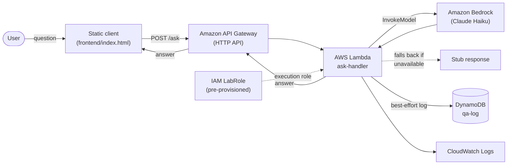

# Architecture

> **Status:** Deployed and verified in the AWS Academy Learner Lab
> (`us-east-1`, stack `ai-cloud-qa-starter`). `/ask` responds correctly end
> to end. Live Bedrock responses are not yet confirmed working in this
> account — see "Known gaps" below — so it currently answers via the stub
> path. See [`docs/LEARNER_LAB_REVIEW.md`](LEARNER_LAB_REVIEW.md) and
> [`docs/DEPLOYMENT.md`](DEPLOYMENT.md) for the deployment walkthrough.

## What this is

A starting architecture for a Q&A prototype: a client submits a question over
HTTP, a backend orchestrates a call to a foundation model, and a response
comes back. It's intentionally minimal — the goal at this stage is a clean,
defensible shape that a team can extend (retrieval, auth, streaming, evals),
not a finished product.

It targets the **AWS Academy Learner Lab** sandbox specifically, which
constrains the design in three ways:

1. **Budget ($50) and session limits (4 hours, auto-extendable).** Idle
   compute is the enemy here — a NAT gateway or load balancer left running
   between sessions burns budget for no benefit. Everything in this design
   is pay-per-request serverless; there is nothing that costs money while
   it isn't being invoked.
2. **No custom IAM.** The Lab provisions one fixed role, `LabRole`, and
   forbids creating new roles or policies. Every resource that needs
   permissions (the Lambda function) is attached to that existing role
   rather than a purpose-built one — see `infra/template.yaml`.
3. **Restricted service list.** The design sticks to services that are
   reliably available in Academy accounts: Lambda, API Gateway, DynamoDB,
   Bedrock, and CloudWatch. No VPC, no EC2, no ECS — none of those are
   needed for this workload and each would add idle-cost risk.

## Components

| Component | Description |
|---|---|
| **Static client** (`frontend/index.html`) | A single-page form: types a question, POSTs it, renders the answer. No build step — plain HTML/JS so it can be opened locally or dropped into an S3 static-website bucket later. |
| **Amazon API Gateway (HTTP API)** | Public HTTPS entry point. Routes `POST /ask` to the Lambda function. Chosen over REST API for lower cost and simpler config for a single-route prototype. |
| **AWS Lambda — `ask-handler`** (`src/app/handler.py`) | Validates the request, calls the Q&A service, returns JSON. Runs on-demand only — no idle cost, no server to patch or leave running across sessions. |
| **Q&A service** (`src/app/qa_service.py`) | Core logic, decoupled from the Lambda entry point so it can be run locally (`scripts/run_local.py`) or unit tested without any AWS dependency. |
| **Amazon Bedrock** | Managed foundation-model inference (default: Anthropic Claude Haiku via Bedrock). No model hosting or GPU management — pay per token, nothing running when idle. |
| **Stub fallback** | If Bedrock access isn't enabled yet, credentials are missing, or `STUB_MODE=true` is set, the service returns a clearly-labeled canned response instead of erroring. This is what lets the prototype "run and return a stubbed response at worst" today, before Bedrock model access is even requested in the Lab console. |
| **Amazon DynamoDB — `qa-log`** | Best-effort log of question/answer pairs (pay-per-request billing, no idle cost). Write failures are swallowed so logging can never break an answer. Groundwork for future evaluation or fine-tuning data. |
| **Amazon CloudWatch Logs** | Automatic Lambda execution logs and API Gateway access logs — the baseline observability every Lambda/API Gateway pair gets for free, no extra setup. |
| **IAM `LabRole`** | Pre-provisioned execution role attached directly to the Lambda function, since the Lab sandbox does not permit creating custom roles or policies. |

## Diagram

## Request flow

1. User types a question into the static client and clicks **Ask**.
2. The client `POST`s `{"question": "..."}` to the API Gateway `/ask` route.
3. API Gateway invokes the `ask-handler` Lambda with the request as an event.
4. The Lambda calls `qa_service.answer_question()`, which:
   - Validates the question is non-empty.
   - Calls Bedrock's `InvokeModel` for the configured model.
   - On any failure (no model access, no credentials, throttling, `STUB_MODE`
     set), returns a labeled stub answer instead of propagating the error.
   - Best-effort writes the question/answer pair to DynamoDB.
5. The Lambda returns a JSON response; API Gateway relays it back to the
   client, which renders it.

## Why these choices

- **Serverless over EC2-based:** the Lab explicitly warns that EC2 instances
  auto-stop but other resources (load balancers, NAT gateways) keep billing
  between sessions. A Lambda + API Gateway + Bedrock stack has zero idle
  cost, so leaving it deployed across sessions doesn't threaten the $50
  budget.
- **Bedrock over self-hosted models:** no GPU instance to provision, patch,
  or forget to shut down; pay-per-token fits the budget constraint directly;
  and it's one of the AWS-native services available in the Academy account
  without extra setup.
- **Stub fallback over a hard dependency on Bedrock:** Bedrock model access
  has to be explicitly requested/enabled per account and isn't guaranteed to
  be available immediately. Building the fallback in from the start means
  the prototype is demonstrable today and upgrades to live answers the
  moment model access is granted — no code change required.
- **DynamoDB over RDS:** no schema migrations, no instance to size or leave
  running, pay-per-request billing matches the "idle costs nothing" goal,
  and a flat Q&A log doesn't need relational structure yet.
- **HTTP API over REST API (API Gateway):** cheaper and simpler for a
  single-route prototype; nothing here needs REST API's extra features
  (usage plans, request validation models, etc.) yet.

## Known gaps / next steps

- **Bedrock is not confirmed working in this Learner Lab account.** It
  doesn't appear in the Lab's supported-services list, and a live deployed
  call to `InvokeModel` fails over to the stub path (caught by the
  try/except in `_invoke_bedrock`), rather than returning a model answer.
  The architecture and code both already assume this is possible (Bedrock
  isn't a hard dependency anywhere), so the fix, if pursued, is scoped to
  either: (a) get Bedrock model access enabled for this account, or (b)
  swap the model call to a directly-invoked API (e.g. Anthropic's API,
  with the key held in Secrets Manager) behind the same
  `answer_question()` interface. Until then, the deployed prototype is
  intentionally stub-only, which is an accepted state for this submission.
- No authentication on the `/ask` endpoint — fine for a Lab prototype behind
  a private URL, not for anything public.
- No retrieval/grounding — this is a plain LLM call, not RAG. If the project
  moves toward a domain-grounded assistant, the natural next component is a
  vector store (e.g., OpenSearch Serverless or a Bedrock Knowledge Base) sitting
  between the Lambda and Bedrock.
- No rate limiting or cost guardrails on model calls — worth adding
  (API Gateway usage plan + throttling) before any wider usage, given the
  fixed Lab budget.
- Frontend is unhosted (opened locally); moving it to an S3 static website
  bucket is a small follow-up once the API is deployed and stable.
